# Лабораторная работа №3

## Фильтрация изображений

---

## Цель работы

Реализовать ранговый фильтр для обработки изображений, а также выполнить анализ результатов фильтрации в полутоновом и монохромном представлении.

---

## Исходные данные

* Использована выборка "Жесть" с сайта slavcorpora.ru
* Вариант: **11**
* Метод: **ранговый фильтр (маска "холм")**
* Размер окна: **3×3**
* Ранг: **12/16**

---

## Теоретические сведения

Перевод в полутоновое изображение выполняется по формуле:

```text
I(x, y) = 0.299R + 0.587G + 0.114B
```

Используемая весовая маска:

```text
1 2 1
2 4 2
1 2 1
```

Сумма весов равна 16.
Результирующее значение определяется как элемент ранга 12:

```text
F(x, y) = Rank_12(W(x, y))
```

---

# 1. Полутоновая обработка

## 1.1 Изображение 1

Источник:
https://www.slavcorpora.ru/images/29fd1f30-ef85-42da-bcca-133ca1839f51/image-2-2.jpeg

| Исходное изображение      | Полутоновое изображение |
| ------------------------- | ----------------------- |
|  | 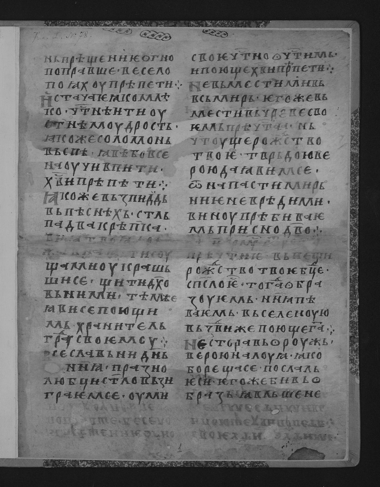 |

| После фильтра                        | Разностное изображение           |
| ------------------------------------ | -------------------------------- |
| 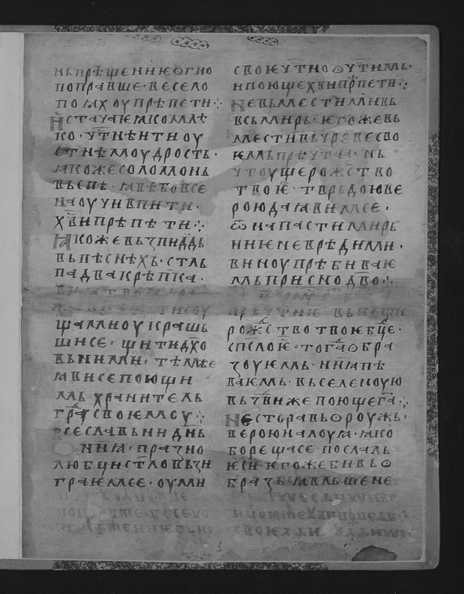 | 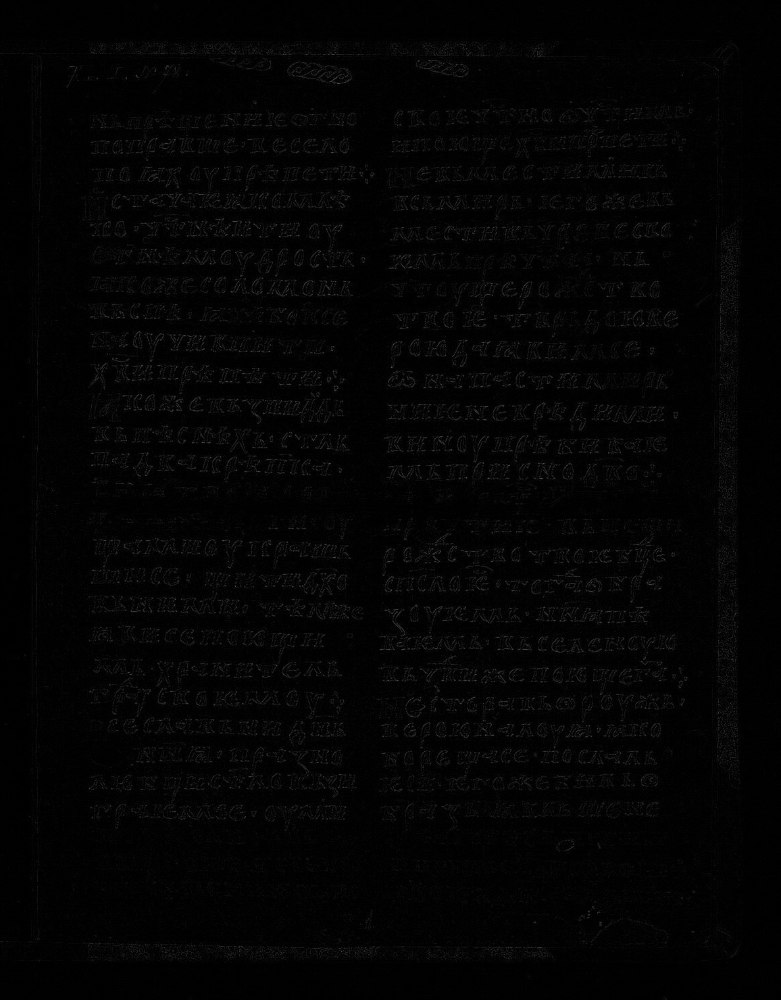 |

| Усиленная разность (×4)             |
| ----------------------------------- |
| 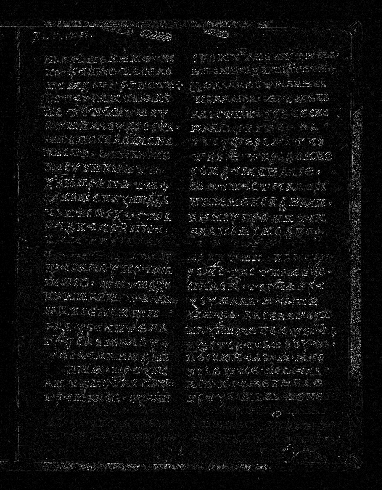 |

---

## 1.2 Изображение 2

Источник:
https://www.slavcorpora.ru/images/bc720407-bd52-47c0-a9db-5cb60a675777/image-4-1.jpeg

| Исходное изображение      | Полутоновое изображение |
| ------------------------- | ----------------------- |
| 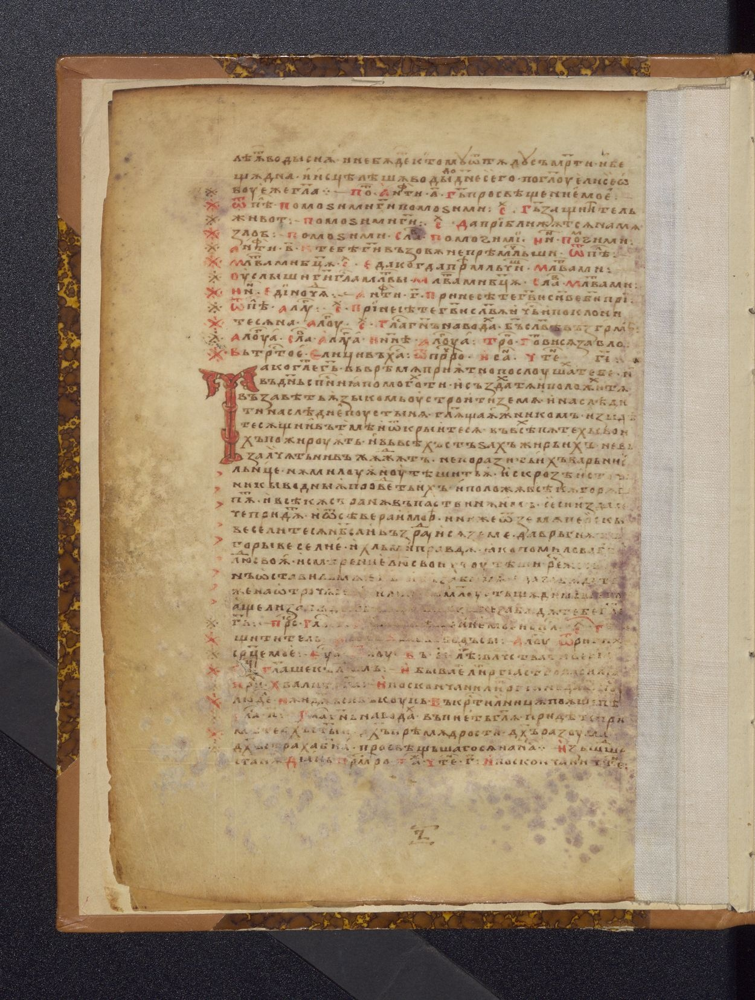 | 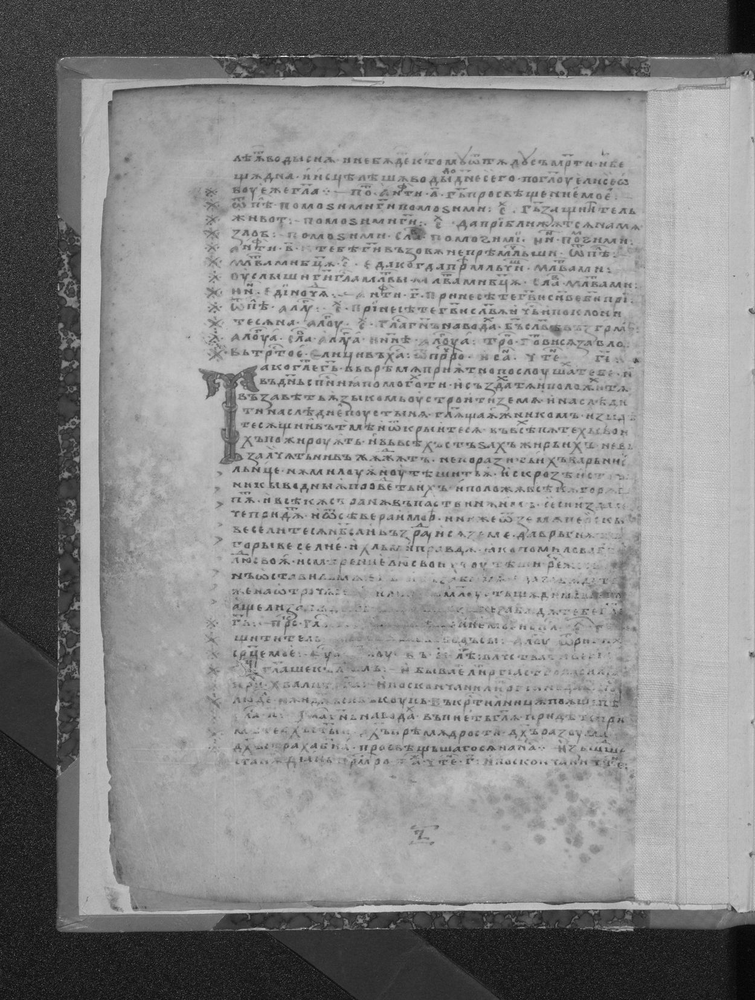 |

| После фильтра                        | Разностное изображение           |
| ------------------------------------ | -------------------------------- |
|  | 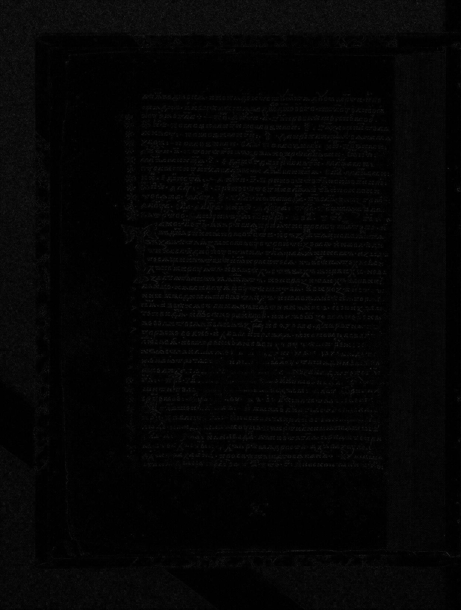 |

| Усиленная разность (×4)             |
| ----------------------------------- |
|  |

---

# 2. Монохромная обработка

## 2.1 Изображение 1

| Исходное                | После фильтра                        |
| ----------------------- | ------------------------------------ |
| 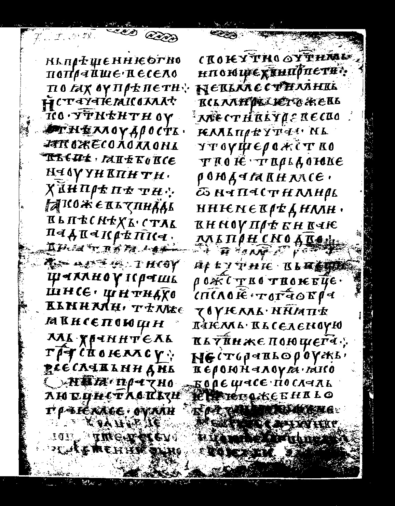 | 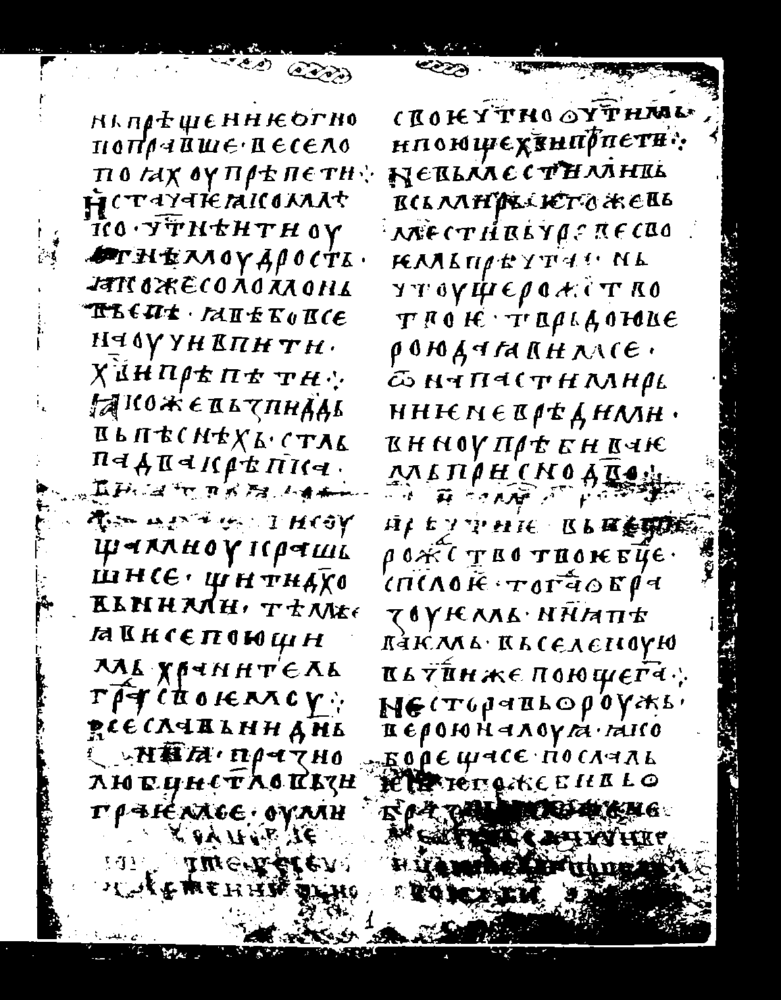 |

| XOR-разность                     |
| -------------------------------- |
| 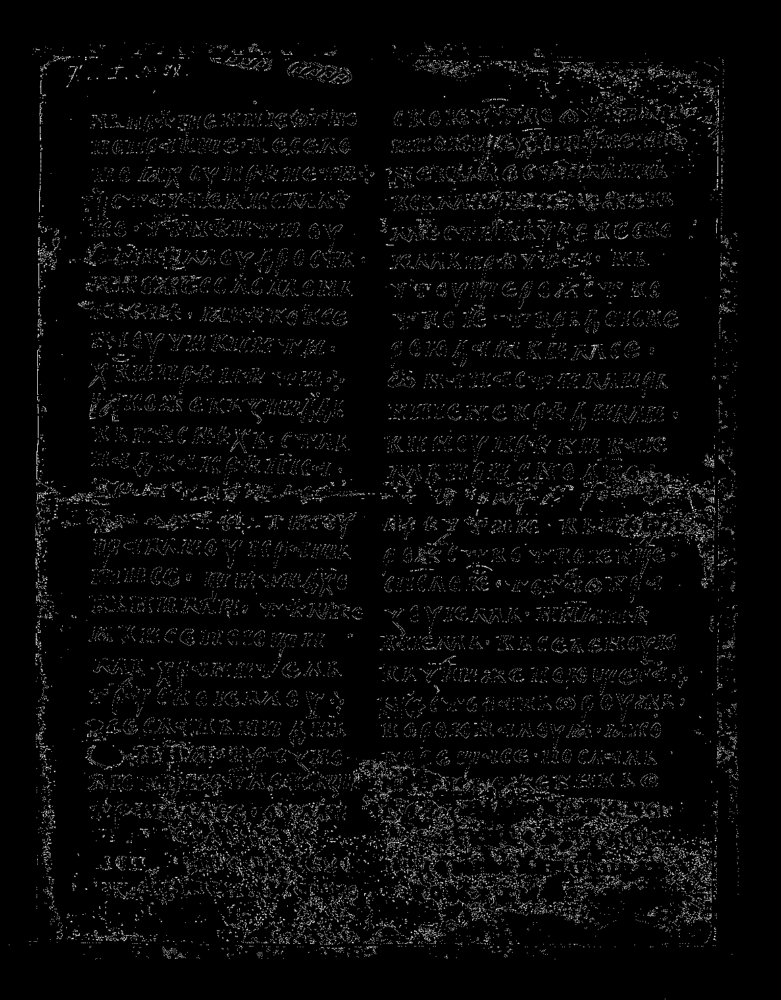 |

---

## 2.2 Изображение 2

| Исходное                | После фильтра                        |
| ----------------------- | ------------------------------------ |
| 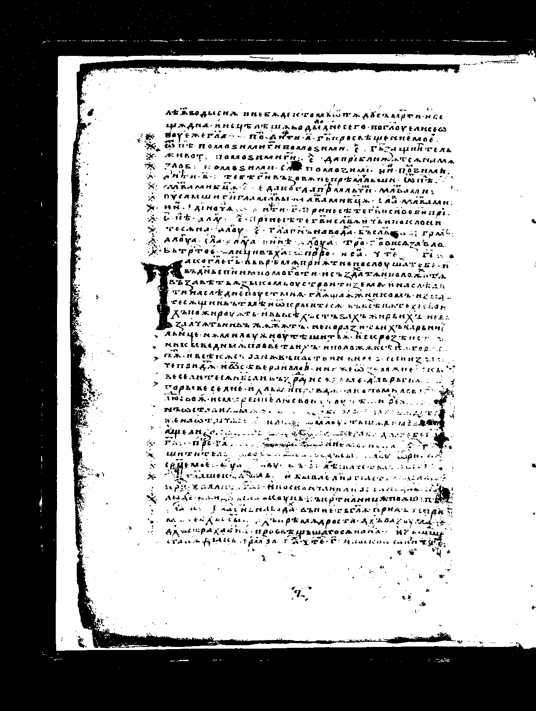 | 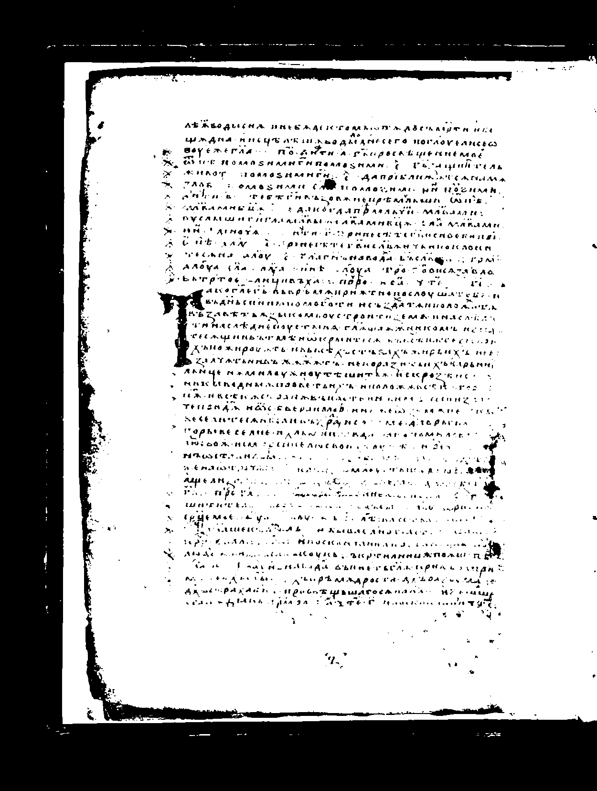 |

| XOR-разность                     |
| -------------------------------- |
| 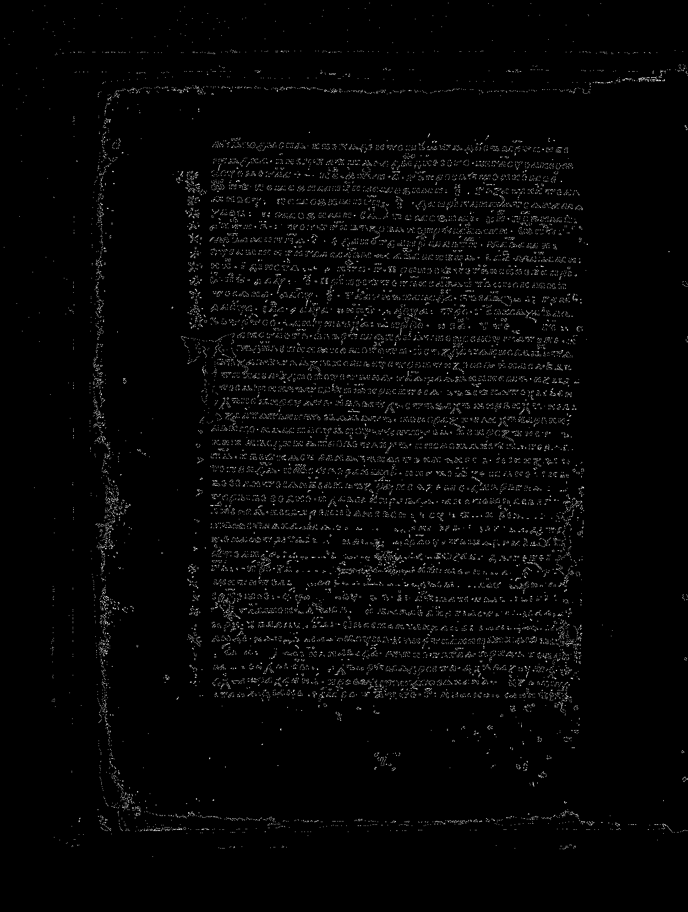 |

---

# 3. Результаты выполнения

| Изображение    | Метод           |
| -------------- | --------------- |
| №1 (индекс 4)  | Ранговый фильтр |
| №2 (индекс 24) | Ранговый фильтр |

---

# Вывод

1. Реализован ранговый фильтр с весовой маской "холм"
2. Использован ранг 12/16
3. Получены полутоновые и монохромные изображения
4. Разностные изображения позволяют оценить влияние фильтра
5. Фильтр эффективно сглаживает шум, сохраняя структуру изображения

---
